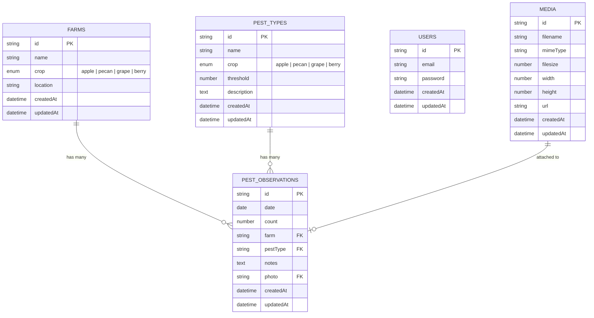
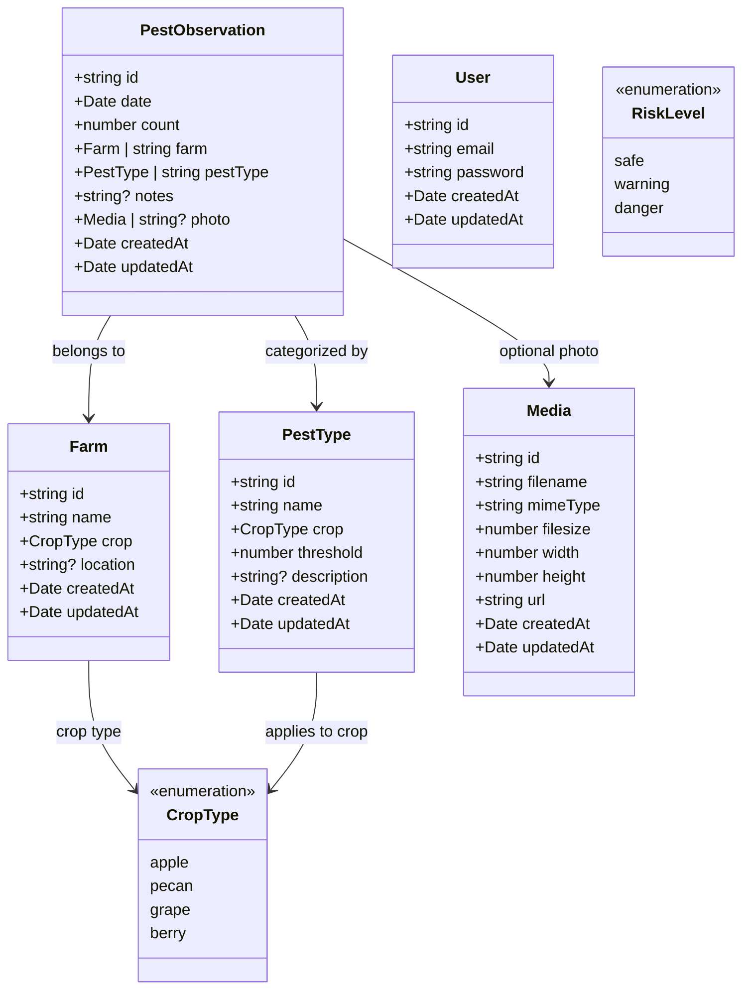
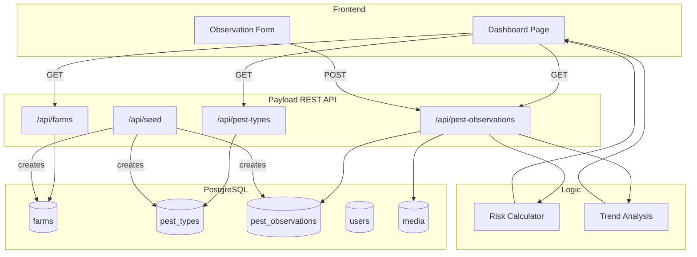
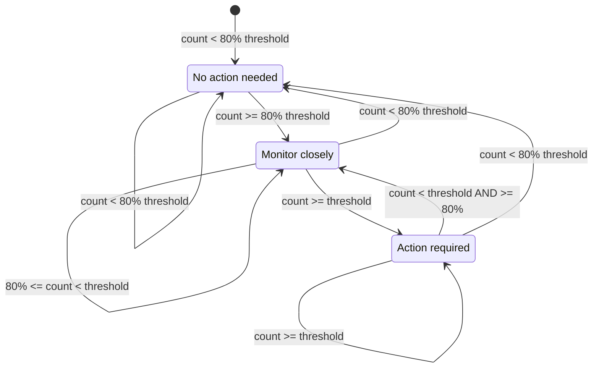

# Catarina — Data Model

## Entity Relationship Diagram

## Class Diagram (TypeScript types)

## Data Flow Diagram

## Risk Calculation State Machine

## Collection Field Details

### Farms
| Field | Type | Required | Default | Description |
|-------|------|----------|---------|-------------|
| `name` | text | Yes | — | Farm name |
| `crop` | select | Yes | `apple` | Crop type (apple, pecan, grape, berry) |
| `location` | text | No | — | Optional location for future use |

### PestTypes
| Field | Type | Required | Default | Description |
|-------|------|----------|---------|-------------|
| `name` | text | Yes | — | Pest name (e.g., "Codling Moth") |
| `crop` | select | Yes | `apple` | Associated crop type |
| `threshold` | number | Yes | `5` | Action threshold count |
| `description` | textarea | No | — | Optional pest description |

### PestObservations
| Field | Type | Required | Default | Description |
|-------|------|----------|---------|-------------|
| `date` | date | Yes | — | Observation date |
| `count` | number | Yes | — | Trap count (min: 0) |
| `farm` | relationship | Yes | — | Reference to Farm |
| `pestType` | relationship | Yes | — | Reference to PestType |
| `notes` | textarea | No | — | Optional notes |
| `photo` | upload | No | — | Optional photo (for future AI feature) |

---

## Notes

- All collections have automatic `id`, `createdAt`, and `updatedAt` fields from Payload CMS.
- Relationships are stored as IDs but can be populated to full objects with `depth` parameter.
- V1 uses open access control (`() => true`) for all operations — single-tenant demo mode.
- The `photo` field on PestObservations is prepared for V4 AI-assisted prefill feature.
